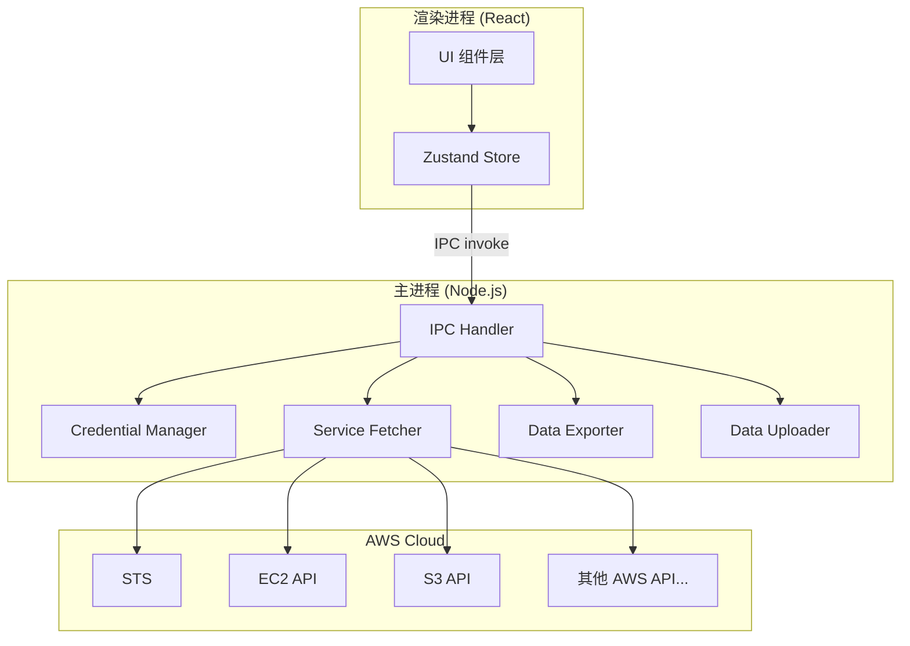
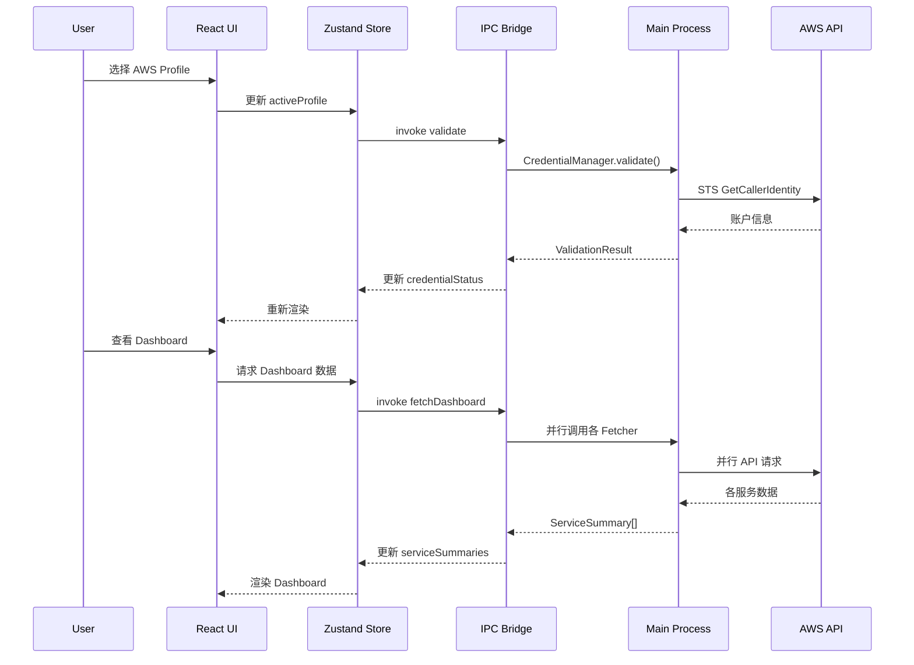

# Design Document: AWS Account Viewer

## Overview

AWS Account Viewer 是一款基于 Electron + React + TypeScript 的跨平台桌面应用程序，面向架构师在客户拜访场景中使用。应用通过 AWS SDK for JavaScript v3 调用 AWS API，全面展示客户 AWS 账户的资源使用情况，涵盖计算、存储、数据库、网络、容器、无服务器、消息队列、CDN、DNS、身份管理和费用等主要服务。

### 技术选型决策

| 技术 | 选择 | 理由 |
|------|------|------|
| 桌面框架 | Electron | 成熟稳定，生态丰富，Node.js 原生支持 AWS SDK，社区资源充足 |
| 前端框架 | React 18 + TypeScript | 组件化开发，类型安全，适合构建复杂仪表盘 UI |
| AWS SDK | @aws-sdk v3 (JS) | 模块化架构，按需引入服务客户端，TypeScript 原生支持 |
| 图表库 | Recharts | 基于 React 和 D3 的声明式图表库，API 简洁，适合指标可视化 |
| UI 组件库 | Ant Design | 企业级 UI 组件库，内置表格、表单、导航等组件，开箱即用 |
| 状态管理 | Zustand | 轻量级状态管理，API 简洁，适合中等复杂度应用 |
| 构建工具 | Vite + electron-builder | Vite 提供快速开发体验，electron-builder 负责跨平台打包 |
| 数据导出 | json2csv + fs | 原生文件系统操作，支持 JSON/CSV 格式导出 |

## Architecture

### 整体架构

应用采用 Electron 的主进程（Main Process）+ 渲染进程（Renderer Process）双进程架构，通过 IPC（进程间通信）桥接。



### 设计决策

1. **AWS API 调用放在主进程**：AWS SDK 需要 Node.js 环境（文件系统访问读取凭证），且避免在渲染进程暴露凭证信息。
2. **Zustand 而非 Redux**：应用状态结构相对扁平（各服务面板数据独立），Zustand 的简洁 API 更适合。
3. **按服务模块化 Fetcher**：每个 AWS 服务对应一个独立的 Fetcher 模块，便于维护和扩展。

### 目录结构

```
aws-account-viewer/
├── src/
│   ├── main/                    # Electron 主进程
│   │   ├── index.ts             # 主进程入口
│   │   ├── ipc/                 # IPC 处理器
│   │   │   └── handlers.ts
│   │   ├── credentials/         # 凭证管理
│   │   │   └── credentialManager.ts
│   │   ├── services/            # AWS 服务数据获取
│   │   │   ├── ec2Fetcher.ts
│   │   │   ├── s3Fetcher.ts
│   │   │   ├── rdsFetcher.ts
│   │   │   ├── lambdaFetcher.ts
│   │   │   ├── elbFetcher.ts
│   │   │   ├── vpcFetcher.ts
│   │   │   ├── iamFetcher.ts
│   │   │   ├── containerFetcher.ts
│   │   │   ├── dynamodbFetcher.ts
│   │   │   ├── cloudfrontFetcher.ts
│   │   │   ├── messagingFetcher.ts
│   │   │   ├── route53Fetcher.ts
│   │   │   ├── metricsFetcher.ts
│   │   │   └── billingFetcher.ts
│   │   ├── export/              # 数据导出
│   │   │   └── dataExporter.ts
│   │   └── upload/              # 数据上传
│   │       └── dataUploader.ts
│   ├── renderer/                # 渲染进程 (React)
│   │   ├── App.tsx
│   │   ├── main.tsx             # 渲染进程入口
│   │   ├── stores/              # Zustand stores
│   │   │   ├── credentialStore.ts
│   │   │   ├── dashboardStore.ts
│   │   │   └── serviceStores.ts
│   │   ├── components/          # UI 组件
│   │   │   ├── layout/
│   │   │   │   ├── AppLayout.tsx
│   │   │   │   ├── ServiceNavigator.tsx
│   │   │   │   └── TopBar.tsx
│   │   │   ├── credential/
│   │   │   │   └── CredentialForm.tsx
│   │   │   ├── dashboard/
│   │   │   │   ├── Dashboard.tsx
│   │   │   │   └── ServiceSummaryCard.tsx
│   │   │   ├── panels/
│   │   │   │   ├── EC2Panel.tsx
│   │   │   │   ├── S3Panel.tsx
│   │   │   │   ├── RDSPanel.tsx
│   │   │   │   ├── LambdaPanel.tsx
│   │   │   │   ├── ELBPanel.tsx
│   │   │   │   ├── VPCPanel.tsx
│   │   │   │   ├── IAMPanel.tsx
│   │   │   │   ├── ContainerPanel.tsx
│   │   │   │   ├── DynamoDBPanel.tsx
│   │   │   │   ├── CloudFrontPanel.tsx
│   │   │   │   ├── MessagingPanel.tsx
│   │   │   │   ├── Route53Panel.tsx
│   │   │   │   ├── MetricsPanel.tsx
│   │   │   │   └── BillingPanel.tsx
│   │   │   ├── charts/
│   │   │   │   └── MetricChart.tsx
│   │   │   └── common/
│   │   │       ├── ErrorDisplay.tsx
│   │   │       ├── LoadingSpinner.tsx
│   │   │       └── StatusBadge.tsx
│   │   └── types/               # TypeScript 类型定义
│   │       └── index.ts
│   ├── shared/                  # 主进程和渲染进程共享
│   │   ├── ipcChannels.ts       # IPC 通道常量
│   │   └── types.ts             # 共享类型定义
│   └── preload/
│       └── index.ts             # preload 脚本，暴露安全 API
├── electron-builder.yml
├── package.json
├── tsconfig.json
└── vite.config.ts
```

## Components and Interfaces

### 1. Credential Manager（凭证管理器）

负责 AWS 凭证的加载、验证和管理。

```typescript
// src/main/credentials/credentialManager.ts

interface AWSProfile {
  name: string;
  accessKeyId?: string;
  secretAccessKey?: string;
  region?: string;
  source: 'file' | 'manual';
}

interface CredentialValidationResult {
  valid: boolean;
  accountId?: string;
  accountAlias?: string;
  error?: {
    type: string;
    message: string;
    suggestion: string;
  };
}

interface ManualCredentialInput {
  accessKeyId: string;
  secretAccessKey: string;
  region: string;
}

class CredentialManager {
  /** 从 ~/.aws/credentials 和 ~/.aws/config 读取所有 profile */
  loadProfiles(): Promise<AWSProfile[]>;

  /** 通过 STS GetCallerIdentity 验证凭证 */
  validateCredential(profile: AWSProfile): Promise<CredentialValidationResult>;

  /** 设置手动输入的凭证 */
  setManualCredential(input: ManualCredentialInput): void;

  /** 获取当前活跃凭证 */
  getActiveCredential(): AWSProfile | null;

  /** 创建 AWS SDK 客户端配置 */
  getClientConfig(region?: string): { credentials: object; region: string };
}
```

### 2. Service Fetcher（服务数据获取器）

每个 AWS 服务对应一个 Fetcher，统一接口设计。

```typescript
// src/shared/types.ts

interface FetchResult<T> {
  data: T;
  timestamp: number;
  region: string;
  error?: {
    code: string;
    message: string;
  };
}

interface ServiceSummary {
  serviceName: string;
  resourceCount: number;
  healthStatus: 'healthy' | 'warning' | 'error';
  icon: string;
}
```

```typescript
// src/main/services/ec2Fetcher.ts (示例)

interface EC2Instance {
  instanceId: string;
  name: string;
  instanceType: string;
  state: string;
  availabilityZone: string;
  publicIp?: string;
  privateIp: string;
}

interface EC2Summary {
  instances: EC2Instance[];
  statusCounts: Record<string, number>;
}

interface EC2Metrics {
  cpuUtilization: MetricDataPoint[];
  networkIn: MetricDataPoint[];
  networkOut: MetricDataPoint[];
}

interface MetricDataPoint {
  timestamp: number;
  value: number;
}

class EC2Fetcher {
  constructor(clientConfig: object);
  fetchInstances(): Promise<FetchResult<EC2Summary>>;
  fetchInstanceMetrics(instanceId: string): Promise<FetchResult<EC2Metrics>>;
}
```

### 3. Data Exporter（数据导出器）

```typescript
// src/main/export/dataExporter.ts

interface ExportMetadata {
  exportTimestamp: string;
  accountId: string;
  region: string;
  dataType: string;
  services: string[];
}

interface ExportOptions {
  format: 'json' | 'csv';
  services: string[];  // 空数组表示全部服务
  filePath: string;
}

interface ExportResult {
  success: boolean;
  filePath: string;
  fileSize: number;
  error?: string;
}

class DataExporter {
  exportData(data: Record<string, unknown>, options: ExportOptions): Promise<ExportResult>;
}
```

### 4. Data Uploader（数据上传器）

```typescript
// src/main/upload/dataUploader.ts

interface UploadConfig {
  apiEndpoint: string;
  authToken: string;
}

interface UploadProgress {
  percentage: number;
  bytesUploaded: number;
  totalBytes: number;
}

interface UploadResult {
  success: boolean;
  dataSize: number;
  duration: number;
  error?: string;
}

class DataUploader {
  configure(config: UploadConfig): void;
  upload(data: Record<string, unknown>, onProgress: (p: UploadProgress) => void): Promise<UploadResult>;
  sanitizeData(data: Record<string, unknown>): Record<string, unknown>;
}
```

### 5. IPC 通信接口

```typescript
// src/shared/ipcChannels.ts

const IPC_CHANNELS = {
  // 凭证管理
  LOAD_PROFILES: 'credential:load-profiles',
  VALIDATE_CREDENTIAL: 'credential:validate',
  SET_MANUAL_CREDENTIAL: 'credential:set-manual',

  // 服务数据
  FETCH_DASHBOARD: 'service:fetch-dashboard',
  FETCH_SERVICE_DATA: 'service:fetch-data',
  FETCH_SERVICE_DETAIL: 'service:fetch-detail',
  FETCH_METRICS: 'service:fetch-metrics',

  // 数据导出/上传
  EXPORT_DATA: 'export:data',
  UPLOAD_DATA: 'upload:data',
  UPLOAD_PROGRESS: 'upload:progress',

  // Region
  SWITCH_REGION: 'region:switch',
  GET_REGIONS: 'region:get-all',

  // 刷新
  REFRESH_ALL: 'refresh:all',
  REFRESH_SERVICE: 'refresh:service',
} as const;
```

### 6. Preload API

```typescript
// src/preload/index.ts

interface ElectronAPI {
  credential: {
    loadProfiles(): Promise<AWSProfile[]>;
    validate(profile: AWSProfile): Promise<CredentialValidationResult>;
    setManual(input: ManualCredentialInput): Promise<CredentialValidationResult>;
  };
  service: {
    fetchDashboard(): Promise<ServiceSummary[]>;
    fetchData(serviceName: string): Promise<FetchResult<unknown>>;
    fetchDetail(serviceName: string, resourceId: string): Promise<FetchResult<unknown>>;
    fetchMetrics(serviceName: string, resourceId: string, timeRange: string): Promise<FetchResult<unknown>>;
  };
  export: {
    exportData(options: ExportOptions): Promise<ExportResult>;
    showSaveDialog(defaultName: string): Promise<string | null>;
  };
  upload: {
    uploadData(): Promise<UploadResult>;
    onProgress(callback: (progress: UploadProgress) => void): void;
  };
  region: {
    getAll(): Promise<string[]>;
    switch(region: string): Promise<void>;
  };
  refresh: {
    all(): Promise<void>;
    service(serviceName: string): Promise<void>;
  };
}
```


## Data Models

### 各服务数据模型

```typescript
// src/shared/types.ts

// ===== 通用类型 =====

interface MetricDataPoint {
  timestamp: number;
  value: number;
}

interface MetricSeries {
  label: string;
  unit: string;
  dataPoints: MetricDataPoint[];
}

type HealthStatus = 'healthy' | 'warning' | 'error';

// ===== EC2 =====

interface EC2Instance {
  instanceId: string;
  name: string;
  instanceType: string;
  state: 'running' | 'stopped' | 'terminated' | 'pending' | 'shutting-down' | 'stopping';
  availabilityZone: string;
  publicIp?: string;
  privateIp: string;
}

// ===== S3 =====

interface S3Bucket {
  name: string;
  creationDate: string;
  region: string;
  objectCount: number;
  totalSize: number;
  storageClassDistribution: Record<string, number>;
}

interface S3BucketDetail {
  accessPolicy: 'public' | 'private';
  versioningEnabled: boolean;
  encryptionConfig: string;
  lifecycleRules: string[];
}

// ===== RDS =====

interface RDSInstance {
  instanceId: string;
  engine: string;
  engineVersion: string;
  instanceClass: string;
  status: string;
  storageSize: number;
  multiAZ: boolean;
  endpoint: string;
}

// ===== Lambda =====

interface LambdaFunction {
  functionName: string;
  runtime: string;
  memorySize: number;
  timeout: number;
  codeSize: number;
  lastModified: string;
  description: string;
}

// ===== ELB =====

interface LoadBalancer {
  name: string;
  type: 'application' | 'network' | 'classic';
  state: string;
  dnsName: string;
  vpcId: string;
  availabilityZones: string[];
  listenerSummary: string;
}

interface TargetGroupHealth {
  targetGroupName: string;
  healthyCount: number;
  unhealthyCount: number;
}

// ===== VPC =====

interface VPC {
  vpcId: string;
  name: string;
  cidrBlock: string;
  subnetCount: number;
  isDefault: boolean;
  state: string;
}

interface Subnet {
  subnetId: string;
  cidrBlock: string;
  availabilityZone: string;
  availableIpCount: number;
}

interface VPCDetail {
  subnets: Subnet[];
  routeTables: { id: string; name: string }[];
  internetGateways: { id: string; name: string }[];
  natGateways: { id: string; name: string; state: string }[];
}

interface SecurityGroup {
  groupId: string;
  groupName: string;
  description: string;
  vpcId: string;
}

// ===== IAM =====

interface IAMSummary {
  userCount: number;
  roleCount: number;
  policyCount: number;
  groupCount: number;
}

interface IAMUser {
  userName: string;
  createDate: string;
  lastActivity?: string;
  mfaEnabled: boolean;
  accessKeyCount: number;
}

interface IAMRole {
  roleName: string;
  createDate: string;
  description: string;
  trustedEntityType: string;
}

// ===== ECS/EKS =====

interface ECSCluster {
  clusterName: string;
  status: string;
  runningServicesCount: number;
  runningTasksCount: number;
  registeredContainerInstancesCount: number;
}

interface ECSService {
  serviceName: string;
  desiredCount: number;
  runningCount: number;
  deploymentStatus: string;
}

interface EKSCluster {
  clusterName: string;
  kubernetesVersion: string;
  status: string;
  endpoint: string;
  platformVersion: string;
}

// ===== DynamoDB =====

interface DynamoDBTable {
  tableName: string;
  status: string;
  partitionKey: string;
  sortKey?: string;
  billingMode: 'ON_DEMAND' | 'PROVISIONED';
  itemCount: number;
  tableSize: number;
}

interface DynamoDBTableDetail {
  globalSecondaryIndexes: { indexName: string; keySchema: string; status: string }[];
  provisionedCapacity?: { readCapacityUnits: number; writeCapacityUnits: number };
}

// ===== CloudFront =====

interface CloudFrontDistribution {
  distributionId: string;
  domainName: string;
  status: 'Deployed' | 'InProgress';
  aliases: string[];
  originSummary: string;
  priceClass: string;
}

// ===== SNS/SQS =====

interface SNSTopic {
  topicName: string;
  topicArn: string;
  subscriptionCount: number;
  displayName: string;
}

interface SQSQueue {
  queueName: string;
  queueType: 'standard' | 'fifo';
  visibleMessages: number;
  invisibleMessages: number;
  delayedMessages: number;
}

interface SQSQueueDetail {
  visibilityTimeout: number;
  messageRetentionPeriod: number;
  maxMessageSize: number;
  deadLetterQueue?: string;
}

// ===== Route 53 =====

interface HostedZone {
  domainName: string;
  hostedZoneId: string;
  type: 'public' | 'private';
  recordSetCount: number;
  description: string;
}

interface DNSRecord {
  name: string;
  type: string;
  ttl: number;
  value: string;
}

// ===== Billing =====

interface BillingSummary {
  totalCost: number;
  currency: string;
  period: string;
  serviceCosts: { serviceName: string; cost: number }[];
  previousMonthComparison: {
    previousTotal: number;
    changePercentage: number;
  };
}

// ===== Dashboard =====

interface ServiceSummary {
  serviceName: string;
  displayName: string;
  resourceCount: number;
  healthStatus: HealthStatus;
  icon: string;
  isGlobal: boolean;
}

// ===== 导出数据结构 =====

interface ExportData {
  metadata: {
    exportTimestamp: string;
    accountId: string;
    region: string;
    dataType: 'full' | 'single-service';
    services: string[];
  };
  data: Record<string, unknown>;
}

// ===== Zustand Store 类型 =====

interface AppState {
  // 凭证状态
  profiles: AWSProfile[];
  activeProfile: AWSProfile | null;
  credentialStatus: 'idle' | 'validating' | 'valid' | 'invalid';
  accountId: string | null;
  accountAlias: string | null;

  // Region 状态
  currentRegion: string;
  availableRegions: string[];

  // Dashboard 状态
  serviceSummaries: ServiceSummary[];
  lastRefreshTime: number | null;

  // 各服务面板数据
  serviceData: Record<string, FetchResult<unknown>>;

  // 加载状态
  loadingServices: Set<string>;
  errors: Record<string, string>;

  // 上传配置
  uploadConfig: UploadConfig | null;
}
```

### 数据流




## Correctness Properties

*A property is a characteristic or behavior that should hold true across all valid executions of a system—essentially, a formal statement about what the system should do. Properties serve as the bridge between human-readable specifications and machine-verifiable correctness guarantees.*

### Property 1: AWS 配置文件解析完整性

*For any* 合法的 AWS CLI 配置文件内容（包含任意数量的 profile、不同的键值对组合、注释和空行），解析函数应提取出所有 profile 名称及其对应的字段值，且不遗漏任何 profile。

**Validates: Requirements 2.1**

### Property 2: 错误映射完整性

*For any* AWS API 错误类型（包括 InvalidClientTokenId、SignatureDoesNotMatch、ExpiredToken、AccessDenied 等），错误映射函数应返回包含 `type`、`message` 和 `suggestion` 三个非空字段的结构化结果。

**Validates: Requirements 2.5**

### Property 3: 健康状态判定有效性

*For any* 服务资源数据集合，健康状态判定函数应返回 `'healthy'`、`'warning'` 或 `'error'` 之一，且对相同输入始终返回相同结果。

**Validates: Requirements 3.3**

### Property 4: AWS 响应数据转换完整性

*For any* AWS API 响应数据（EC2 DescribeInstances、S3 ListBuckets、RDS DescribeDBInstances、Lambda ListFunctions、ELB DescribeLoadBalancers、VPC DescribeVpcs、IAM ListUsers/ListRoles、ECS DescribeClusters、EKS DescribeCluster、DynamoDB DescribeTable、CloudFront ListDistributions、SNS ListTopics、SQS ListQueues、Route53 ListHostedZones），对应的转换函数应提取出该服务所有必需的展示字段，且输出数组长度等于输入资源数量。

**Validates: Requirements 4.2, 5.2, 6.2, 7.2, 8.2, 9.2, 9.4, 10.3, 10.4, 11.2, 11.3, 12.2, 13.2, 14.2, 14.3, 15.2**

### Property 5: 汇总计数一致性

*For any* 服务资源列表，按类别/状态/类型分组后的计数之和应等于列表总长度。适用于 EC2 状态汇总、RDS 引擎类型汇总、Lambda 运行时汇总、ELB 类型汇总、IAM 资源汇总、DynamoDB 计费模式汇总、CloudFront 状态汇总、Route 53 区域类型汇总和 S3 存储桶汇总。

**Validates: Requirements 4.3, 5.3, 6.3, 7.3, 8.3, 10.2, 12.3, 13.3, 15.4**

### Property 6: 时间范围转换正确性

*For any* 时间范围选择（1 小时、6 小时、24 小时、7 天），转换函数生成的 startTime 和 endTime 之差应等于所选时间范围的毫秒数，且 endTime 不超过当前时间。

**Validates: Requirements 16.4**

### Property 7: 费用对比百分比计算正确性

*For any* 当月费用 current 和上月费用 previous（previous > 0），计算的增减百分比应等于 `(current - previous) / previous * 100`，且当 previous 为 0 时应返回特殊标识而非除零错误。

**Validates: Requirements 17.3**

### Property 8: JSON 导出 round-trip

*For any* 合法的服务数据对象，将其通过 DataExporter 导出为 JSON 字符串后再解析回对象，应与原始数据等价。

**Validates: Requirements 18.1**

### Property 9: CSV 导出结构验证

*For any* 包含 N 条记录的服务数据列表，导出为 CSV 后的行数应等于 N + 1（含表头行），且表头行包含所有必需的字段名。

**Validates: Requirements 18.2**

### Property 10: 导出元数据完整性

*For any* 导出参数组合（accountId、region、services 列表），导出的 JSON 数据的 `metadata` 字段应包含 `exportTimestamp`、`accountId`、`region`、`dataType` 和 `services` 五个非空字段，且 `services` 列表与输入一致。

**Validates: Requirements 18.4**

### Property 11: 选择性导出过滤正确性

*For any* 全量服务数据和服务选择列表，导出结果应仅包含选中服务的数据，且不包含未选中服务的数据。当选择列表为空时，应导出全部服务数据。

**Validates: Requirements 18.6**

### Property 12: 数据脱敏安全性

*For any* 包含 AWS 凭证信息（Access Key ID 格式 `AKIA...`、Secret Access Key）的嵌套数据对象，脱敏函数处理后的输出中不应包含任何匹配 AWS 凭证模式的字符串，且非凭证数据应保持不变。

**Validates: Requirements 19.6**

### Property 13: 部分刷新失败处理

*For any* 服务列表和成功/失败状态组合，刷新操作后成功的服务数据应被更新（时间戳更新），失败的服务应保留旧数据并附带错误信息。

**Validates: Requirements 20.4**

### Property 14: 全局服务 Region 不变性

*For any* Region 切换操作，全局服务（S3、IAM、CloudFront、Route 53）的数据应保持不变，非全局服务的数据应触发重新加载。

**Validates: Requirements 21.4**

### Property 15: 服务分组正确性

*For any* 服务列表，分组函数应将每个服务分配到且仅分配到一个预定义类别（计算、存储、数据库、网络、消息、安全、监控、费用），且所有服务都被分配，无遗漏。

**Validates: Requirements 22.2**

## Error Handling

### 错误处理策略

应用采用分层错误处理策略：

| 层级 | 错误类型 | 处理方式 |
|------|----------|----------|
| AWS API 层 | 凭证错误 | 映射为用户友好的错误信息，包含修复建议 |
| AWS API 层 | 权限不足 | 显示缺少的权限名称，建议联系管理员 |
| AWS API 层 | 限流 (Throttling) | 自动退避重试（指数退避，最多 3 次） |
| AWS API 层 | 网络超时 | 显示超时错误，提供重试按钮 |
| AWS API 层 | 服务不可用 | 显示服务状态，建议稍后重试 |
| 数据导出层 | 文件写入失败 | 提示检查路径权限 |
| 数据上传层 | 网络错误 | 自动重试 3 次（间隔 5 秒），全部失败后显示错误 |
| 凭证层 | 配置文件解析失败 | 提示配置文件格式错误，建议手动输入 |
| UI 层 | 组件渲染错误 | React Error Boundary 捕获，显示降级 UI |

### 错误信息映射

```typescript
const ERROR_MAP: Record<string, { message: string; suggestion: string }> = {
  InvalidClientTokenId: {
    message: 'Access Key ID 无效',
    suggestion: '请检查 Access Key ID 是否正确，或该密钥是否已被删除',
  },
  SignatureDoesNotMatch: {
    message: 'Secret Access Key 不匹配',
    suggestion: '请检查 Secret Access Key 是否正确',
  },
  ExpiredToken: {
    message: '临时凭证已过期',
    suggestion: '请重新获取临时凭证或使用长期凭证',
  },
  AccessDenied: {
    message: '权限不足',
    suggestion: '当前凭证缺少所需的 IAM 权限，请联系管理员添加相应权限',
  },
  // ... 其他错误类型
};
```

### 各面板统一错误处理

每个服务面板采用统一的错误处理模式：
- 加载失败时显示错误信息和重试按钮
- 部分数据加载失败时展示已成功加载的数据，对失败部分单独显示错误
- 全局刷新时部分失败不影响已成功的数据更新

## Testing Strategy

### 测试框架

| 类型 | 工具 | 用途 |
|------|------|------|
| 单元测试 | Vitest | 纯函数逻辑测试 |
| 属性测试 | fast-check + Vitest | 基于属性的测试（Correctness Properties） |
| 组件测试 | React Testing Library | React 组件渲染和交互测试 |
| 集成测试 | Vitest + AWS SDK Mock | AWS API 调用逻辑测试 |
| E2E 测试 | Playwright + Electron | 端到端流程测试 |

### 属性测试（Property-Based Testing）

使用 [fast-check](https://github.com/dubzzz/fast-check) 库实现属性测试，每个属性测试配置最少 100 次迭代。

每个属性测试必须以注释标注对应的设计属性：
```typescript
// Feature: aws-account-viewer, Property 1: AWS 配置文件解析完整性
```

属性测试覆盖的核心模块：
- **CredentialManager**: 配置文件解析（Property 1）、错误映射（Property 2）
- **数据转换函数**: AWS 响应转换（Property 4）、汇总计数（Property 5）
- **DataExporter**: JSON round-trip（Property 8）、CSV 结构（Property 9）、元数据（Property 10）、选择性导出（Property 11）
- **DataUploader**: 数据脱敏（Property 12）
- **状态管理逻辑**: 健康状态判定（Property 3）、部分刷新（Property 13）、Region 不变性（Property 14）
- **工具函数**: 时间范围转换（Property 6）、费用计算（Property 7）、服务分组（Property 15）

### 单元测试

单元测试聚焦于：
- 具体的边界条件和错误场景
- UI 组件的渲染验证
- 特定的业务规则示例

### 集成测试

使用 AWS SDK Mock 模拟 AWS API 响应：
- 凭证验证流程（STS GetCallerIdentity）
- 各服务数据加载流程
- 数据刷新和 Region 切换流程
- 数据上传重试逻辑

### E2E 测试

使用 Playwright 配合 Electron 进行端到端测试：
- 完整的凭证配置 → Dashboard 加载 → 服务浏览流程
- 数据导出和上传流程
- Region 切换和数据刷新流程
