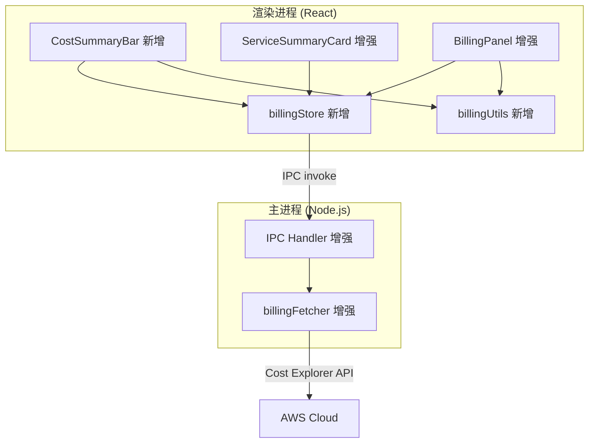
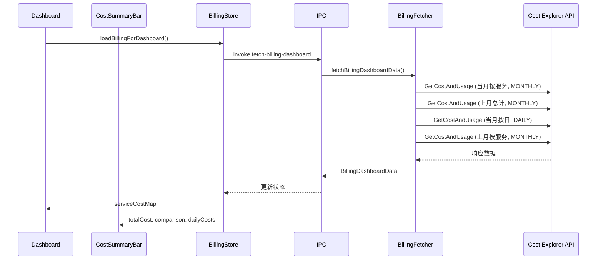
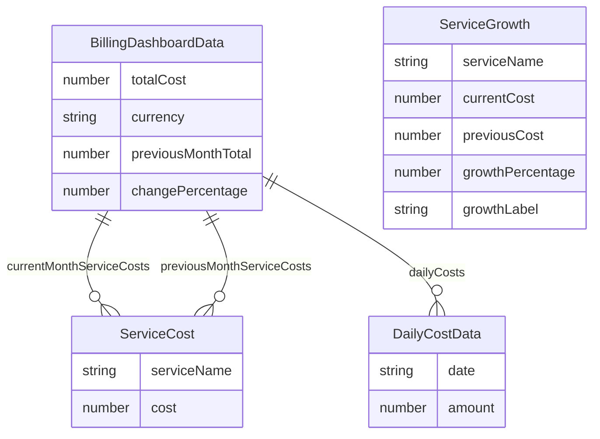

# 设计文档：账单 Dashboard 增强

## Overview

本设计文档描述 AWS Account Viewer 桌面应用的账单增强功能。在现有基础上（BillingPanel 展示当月总费用、按服务柱状图/饼图、上月对比；Dashboard 的 ServiceSummaryCard 仅展示资源数量），本次增强将费用信息深度融入 Dashboard 和 BillingPanel，新增以下核心能力：

1. **Dashboard 服务卡片费用展示**：在每个 ServiceSummaryCard 上显示该服务当月费用
2. **Dashboard 顶部费用摘要栏**：新增 CostSummaryBar 组件，展示总费用、环比对比、7 天迷你趋势图
3. **按日费用数据获取**：扩展 billingFetcher 支持 DAILY 粒度的费用数据获取
4. **费用趋势图**：在 BillingPanel 中展示按日费用趋势折线图（含实际和预测）
5. **费用预测**：基于线性外推计算月末预测费用
6. **Top N 费用增长服务**：展示费用增长最快的前 5 个服务

### 设计原则

- **增量增强**：在现有代码基础上扩展，不重构已有功能
- **关注点分离**：纯计算逻辑（格式化、预测、增长率）提取为独立可测试函数
- **一致性**：遵循现有的 IPC 通信模式、Zustand 状态管理模式和 Ant Design + Recharts UI 模式

## Architecture

### 整体架构变更

本次增强不改变现有的主进程/渲染进程双进程架构，仅在各层新增模块：



### 数据流



### 新增 IPC 通道

在现有 IPC 通道基础上新增一个专用通道，用于一次性获取 Dashboard 所需的全部账单数据：

```
FETCH_BILLING_DASHBOARD: 'billing:fetch-dashboard'
```

该通道将在一次调用中返回所有 Dashboard 和 BillingPanel 增强所需的数据，避免多次 IPC 往返。

## Components and Interfaces

### 1. billingFetcher.ts 增强（主进程）

在现有 `fetchBillingData` 基础上新增函数：

```typescript
// src/main/services/billingFetcher.ts

/** 按日费用数据 */
interface DailyCostData {
  date: string;    // YYYY-MM-DD
  amount: number;  // 费用金额
}

/** 按服务分类的费用数据 */
interface ServiceCost {
  serviceName: string;
  cost: number;
}

/** Dashboard 账单综合数据 */
interface BillingDashboardData {
  // 当月按服务费用（复用现有逻辑）
  currentMonthServiceCosts: ServiceCost[];
  totalCost: number;
  currency: string;
  // 上月对比
  previousMonthTotal: number;
  changePercentage: number;
  // 当月按日费用（新增）
  dailyCosts: DailyCostData[];
  // 上月按服务费用（新增，用于增长率计算）
  previousMonthServiceCosts: ServiceCost[];
}

/**
 * 获取 Dashboard 所需的全部账单数据。
 * 并行发起 4 个 Cost Explorer API 调用：
 * 1. 当月按服务费用 (MONTHLY, GROUP BY SERVICE)
 * 2. 上月总费用 (MONTHLY)
 * 3. 当月按日费用 (DAILY)
 * 4. 上月按服务费用 (MONTHLY, GROUP BY SERVICE)
 */
export async function fetchBillingDashboardData(
  clientConfig: ClientConfig,
): Promise<FetchResult<BillingDashboardData>>;

/**
 * 解析 Cost Explorer DAILY 响应为 DailyCostData 数组。
 * 输出按日期升序排列。
 * 导出以便单元测试。
 */
export function parseDailyResponse(
  resultsByTime: CostExplorerResultsByTime[],
): DailyCostData[];
```

### 2. billingUtils.ts（新增，渲染进程）

提取纯计算逻辑为独立模块，便于测试：

```typescript
// src/renderer/utils/billingUtils.ts

/**
 * 将数字格式化为带千位分隔符的货币字符串。
 * 例：1234.5 → "$1,234.50"
 */
export function formatCurrency(amount: number, currency?: string): string;

/**
 * 从 dailyCosts 中提取最近 N 天的数据。
 * 返回按日期升序排列的子集。
 */
export function getRecentDays(
  dailyCosts: DailyCostData[],
  days: number,
): DailyCostData[];

/**
 * 计算日均费用。
 * 返回 totalAmount / days，days 为 0 时返回 0。
 */
export function calculateDailyAverage(dailyCosts: DailyCostData[]): number;

/**
 * 基于线性外推计算月末预测总费用。
 * forecast = dailyAverage * totalDaysInMonth
 * 数据天数 < 3 时返回 null（数据不足）。
 */
export function calculateForecast(
  dailyCosts: DailyCostData[],
  totalDaysInMonth: number,
): number | null;

/**
 * 生成预测线数据点（从当前日期到月末）。
 * 每天的预测值 = dailyAverage。
 */
export function generateForecastLine(
  dailyCosts: DailyCostData[],
  totalDaysInMonth: number,
): DailyCostData[];

/**
 * 将服务费用列表转换为 serviceName → cost 的映射。
 */
export function buildServiceCostMap(
  serviceCosts: ServiceCost[],
): Record<string, number>;

/**
 * 计算各服务的费用增长率，返回按增长率降序排列的前 N 个服务。
 * - 当月费用为零的服务被排除
 * - 上月费用为零且当月 > 0 的服务标记为 "新增"（growthLabel: 'new'）
 * - 其他服务计算百分比增长率
 */
export interface ServiceGrowth {
  serviceName: string;
  currentCost: number;
  previousCost: number;
  growthPercentage: number | null;  // null 表示 "新增"
  growthLabel: 'new' | 'percentage';
}

export function getTopGrowthServices(
  currentServiceCosts: ServiceCost[],
  previousServiceCosts: ServiceCost[],
  topN?: number,  // 默认 5
): ServiceGrowth[];

/**
 * 将费用金额与服务摘要进行匹配。
 * 返回 serviceName → cost 的映射，未匹配到的服务返回 0。
 */
export function matchServiceCosts(
  serviceCosts: ServiceCost[],
  serviceSummaries: { serviceName: string }[],
): Record<string, number>;
```

### 3. billingStore.ts（新增，渲染进程）

新增 Zustand store 管理账单增强数据：

```typescript
// src/renderer/stores/billingStore.ts

interface BillingStoreState {
  // 数据
  totalCost: number;
  currency: string;
  previousMonthTotal: number;
  changePercentage: number;
  dailyCosts: DailyCostData[];
  serviceCostMap: Record<string, number>;  // serviceName → cost
  topGrowthServices: ServiceGrowth[];
  forecast: number | null;

  // 状态
  isLoading: boolean;
  error: string | null;
  costExplorerDisabled: boolean;

  // 操作
  loadBillingForDashboard: () => Promise<void>;
  reset: () => void;
}
```

### 4. CostSummaryBar 组件（新增）

```typescript
// src/renderer/components/dashboard/CostSummaryBar.tsx

interface CostSummaryBarProps {
  totalCost: number;
  currency: string;
  previousMonthTotal: number;
  changePercentage: number;
  dailyCosts: DailyCostData[];
  isLoading: boolean;
  error: string | null;
  costExplorerDisabled: boolean;
  onRetry: () => void;
}
```

该组件渲染在 Dashboard 顶部，包含：
- 当月总费用（带千位分隔符）
- 上月对比（金额 + 百分比 + 颜色箭头）
- 最近 7 天迷你趋势折线图（使用 Recharts LineChart，高度约 60px）
- 加载中显示 Ant Design Skeleton
- 错误时显示提示 + 重试按钮
- Cost Explorer 未启用时显示提示 + 跳转链接

### 5. ServiceSummaryCard 增强

在现有 ServiceSummaryCard 组件中，在资源数量下方新增费用显示区域：

```typescript
// ServiceSummaryCard props 增强
interface ServiceSummaryCardProps {
  summary: ServiceSummary;
  cost?: number | null;  // 新增：该服务当月费用，null 表示加载失败
  onClick: () => void;
}
```

- `cost` 为 number 时显示 `$X.XX`
- `cost` 为 0 时显示 `$0.00`
- `cost` 为 null 时显示 `—`
- `cost` 为 undefined 时（数据未加载）不显示费用区域

### 6. BillingPanel 增强

在现有 BillingPanel 顶部新增：
- **按日费用趋势折线图**：实际费用（实线蓝色）+ 预测费用（虚线灰色）
- **预测月末费用卡片**：显示预测金额
- **日均费用统计**：显示在趋势图下方
- **Top 5 费用增长服务列表**：表格形式，含服务名、当月费用、上月费用、增长率

### 7. IPC Handler 增强

在 `handlers.ts` 中新增 `billing:fetch-dashboard` 通道处理：

```typescript
ipcMain.handle('billing:fetch-dashboard', async () => {
  const clientConfig = credentialManager.getClientConfig();
  return fetchBillingDashboardData(clientConfig);
});
```

### 8. Preload API 增强

在 preload 脚本中新增：

```typescript
billing: {
  fetchDashboard: () => ipcRenderer.invoke('billing:fetch-dashboard'),
}
```

## Data Models

### 新增类型定义

```typescript
// src/shared/types.ts 新增

/** 按日费用数据 */
export interface DailyCostData {
  date: string;    // YYYY-MM-DD 格式
  amount: number;  // 费用金额（美元）
}

/** Dashboard 账单综合数据 */
export interface BillingDashboardData {
  currentMonthServiceCosts: { serviceName: string; cost: number }[];
  totalCost: number;
  currency: string;
  previousMonthTotal: number;
  changePercentage: number;
  dailyCosts: DailyCostData[];
  previousMonthServiceCosts: { serviceName: string; cost: number }[];
}

/** 服务费用增长信息 */
export interface ServiceGrowth {
  serviceName: string;
  currentCost: number;
  previousCost: number;
  growthPercentage: number | null;  // null 表示 "新增"
  growthLabel: 'new' | 'percentage';
}
```

### 现有类型不变

`BillingSummary`、`ServiceSummary`、`FetchResult<T>` 等现有类型保持不变，新功能通过新增类型实现。

### 数据关系



## Correctness Properties

*A property is a characteristic or behavior that should hold true across all valid executions of a system—essentially, a formal statement about what the system should do. Properties serve as the bridge between human-readable specifications and machine-verifiable correctness guarantees.*

### Property 1: 费用格式化正确性

*For any* 非负数 amount，`formatCurrency(amount)` 的输出应以 "$" 开头，包含恰好两位小数，且对于 amount ≥ 1000 的值应包含千位分隔符逗号。

**Validates: Requirements 2.1**

### Property 2: 服务费用匹配完整性

*For any* serviceCosts 数组和 serviceSummaries 数组，`matchServiceCosts` 返回的映射应满足：对于 serviceCosts 中存在的服务，映射值等于其费用金额；对于 serviceCosts 中不存在的服务，映射值为 0。

**Validates: Requirements 1.1, 1.2**

### Property 3: 按日费用数据解析与排序

*For any* Cost Explorer DAILY 响应数据（包含任意数量的 ResultsByTime 条目），`parseDailyResponse` 的输出应满足：每条记录包含有效的 YYYY-MM-DD 日期和数值金额，且输出按日期升序排列。

**Validates: Requirements 3.2, 3.3**

### Property 4: 费用预测线性外推正确性

*For any* 包含 3 天或以上数据的 DailyCostData 数组和月总天数 totalDaysInMonth，`calculateForecast` 的返回值应等于 `(总费用 / 数据天数) * totalDaysInMonth`。当数据天数少于 3 天时应返回 null。

**Validates: Requirements 5.1, 5.4, 5.5**

### Property 5: 日均费用计算正确性

*For any* 非空的 DailyCostData 数组，`calculateDailyAverage` 的返回值应等于数组中所有 amount 之和除以数组长度。空数组应返回 0。

**Validates: Requirements 4.5**

### Property 6: Top N 费用增长服务排序与过滤

*For any* 当月和上月的 serviceCosts 数组，`getTopGrowthServices` 的输出应满足：(a) 不包含当月费用为零的服务；(b) 上月费用为零且当月大于零的服务标记为 "新增"（growthLabel='new'）；(c) 输出按增长率降序排列（"新增" 排在最前）；(d) 输出长度不超过 topN。

**Validates: Requirements 6.1, 6.3, 6.4, 6.5, 6.6**

### Property 7: 最近 N 天数据提取正确性

*For any* DailyCostData 数组和正整数 N，`getRecentDays` 的输出应满足：长度为 min(N, 输入长度)，包含输入中日期最大的 N 条记录，且按日期升序排列。

**Validates: Requirements 2.3**

### Property 8: 费用变化百分比计算正确性

*For any* 非负数 current 和 previous（previous > 0），`calculateChangePercentage(current, previous)` 应返回 `(current - previous) / previous * 100`。当 previous 为 0 时应返回 null 而非抛出除零错误。

**Validates: Requirements 2.2**

## Error Handling

### 错误处理策略

本次增强遵循现有应用的分层错误处理模式：

| 场景 | 处理方式 |
|------|----------|
| Cost Explorer 未启用 | CostSummaryBar 显示 "Cost Explorer 未启用" 提示 + 跳转链接；ServiceSummaryCard 费用显示 "—" |
| Cost Explorer API 调用失败 | CostSummaryBar 显示 "费用数据不可用" + 重试按钮；ServiceSummaryCard 费用显示 "—"；BillingPanel 保留现有错误处理 |
| 按日数据获取失败 | 趋势图区域显示错误提示；预测功能不可用；其他费用数据正常展示 |
| 部分 API 调用失败 | 成功获取的数据正常展示，失败的部分显示对应错误提示 |
| 数据不足（< 2 天） | 趋势图显示 "数据不足" 提示 |
| 数据不足（< 3 天） | 预测功能显示 "数据不足，暂无法预测" |
| 全零费用数据 | 正常展示 $0.00，预测也显示 $0.00 |

### 错误传播

```
Cost Explorer API 错误
  → billingFetcher 捕获，返回 FetchResult 带 error 字段
    → IPC 传递到渲染进程
      → billingStore 更新 error/costExplorerDisabled 状态
        → UI 组件根据状态渲染对应的错误/提示界面
```

### 降级策略

- 费用数据加载失败不影响 Dashboard 资源数量的正常展示
- CostSummaryBar 加载失败不阻塞 Dashboard 其余内容渲染
- BillingPanel 中新增功能（趋势图、预测、Top N）加载失败不影响现有功能（总费用、柱状图、饼图、明细表）

## Testing Strategy

### 测试框架

沿用现有项目配置：

| 类型 | 工具 | 用途 |
|------|------|------|
| 单元测试 | Vitest | 纯函数逻辑测试 |
| 属性测试 | fast-check + Vitest | 基于属性的测试（Correctness Properties） |
| 组件测试 | React Testing Library + Vitest | React 组件渲染和交互测试 |

### 属性测试（Property-Based Testing）

使用 [fast-check](https://github.com/dubzzz/fast-check) 库实现属性测试，每个属性测试配置最少 100 次迭代。

每个属性测试必须以注释标注对应的设计属性：
```typescript
// Feature: billing-dashboard-enhancement, Property 1: 费用格式化正确性
```

属性测试覆盖的核心模块：
- **billingUtils.ts**: formatCurrency (Property 1)、matchServiceCosts (Property 2)、calculateDailyAverage (Property 5)、calculateForecast (Property 4)、getTopGrowthServices (Property 6)、getRecentDays (Property 7)
- **billingFetcher.ts**: parseDailyResponse (Property 3)、calculateChangePercentage (Property 8)

### 单元测试

单元测试聚焦于：
- **边界条件**：费用为零、数据天数不足、空数组、全零数据
- **UI 组件渲染**：CostSummaryBar 的加载/错误/正常状态、ServiceSummaryCard 费用显示、BillingPanel 趋势图和预测区域
- **错误处理**：Cost Explorer 未启用、API 调用失败、部分数据加载失败

### 集成测试

- 使用 mock 的 Cost Explorer 响应测试 `fetchBillingDashboardData` 的完整流程
- 测试 IPC 通道 `billing:fetch-dashboard` 的请求/响应
- 测试 Dashboard 加载时 billingStore 与 dashboardStore 的协同工作
